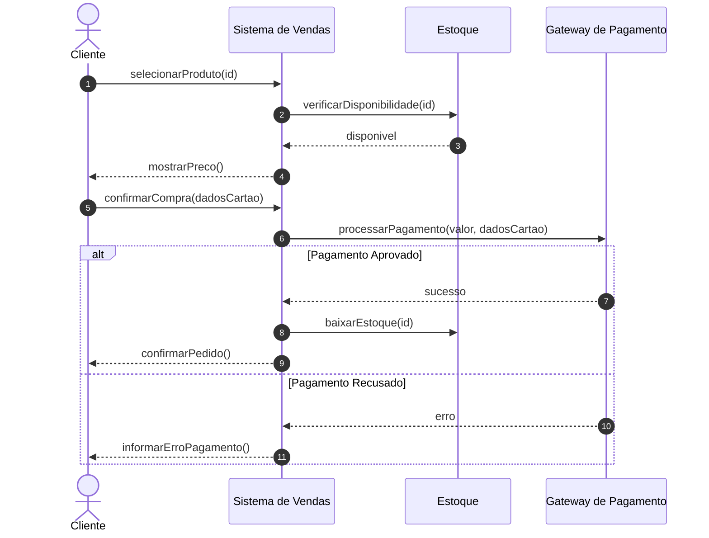
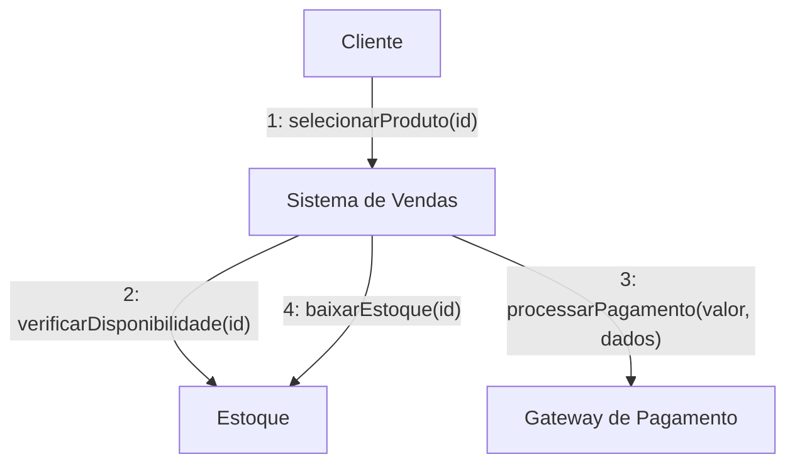
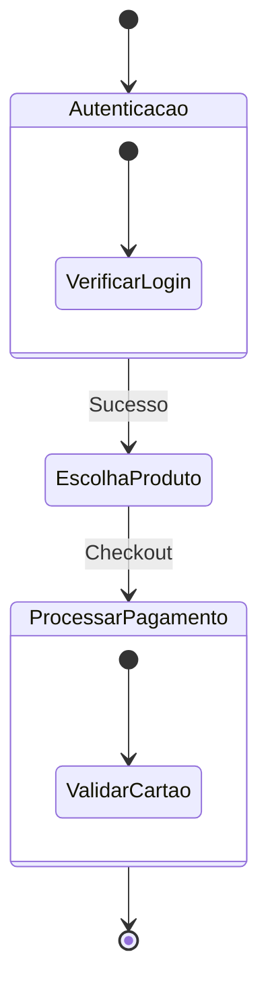

> **Curso:** Engenharia de Software  
> **Disciplina:** Análise e Projeto Orientado a Objetos    
> **Professor:** José Carlos Flores  
> **Tema:**  Diagramas de Interação     
---

## Introdução

Prezados acadêmicos, na disciplina de Análise e Projeto Orientado a Objetos, a compreensão aprofundada da Unified Modeling Language (UML) é fundamental para a modelagem eficaz de sistemas de software. Dentre os diversos diagramas que a UML oferece, os **Diagramas de Interação** desempenham um papel muito importante ao ilustrar o comportamento dinâmico de um sistema, focando na troca de mensagens e na sequência de eventos entre os objetos. Esta aula tem como objetivo desmistificar esses diagramas, apresentando-os de forma detalhada, com exemplos práticos e figuras ilustrativas, para que vocês possam aplicá-los com confiança em seus projetos.

Os diagramas de interação são essenciais para visualizar como diferentes partes de um sistema colaboram para alcançar um objetivo específico. Eles complementam os diagramas estruturais, que descrevem a composição estática do sistema, ao adicionar a dimensão temporal e de fluxo de controle. A UML 2.x define quatro tipos principais de diagramas de interação: Diagrama de Sequência, Diagrama de Comunicação (anteriormente Diagrama de Colaboração), Diagrama de Visão Geral de Interação e Diagrama de Tempo.

## 1. Diagrama de Sequência

O **Diagrama de Sequência** é, talvez, o mais conhecido e utilizado dos diagramas de interação. Ele enfatiza a ordem temporal das mensagens trocadas entre os objetos (ou *lifelines*) de um sistema para realizar uma funcionalidade específica. É uma ferramenta poderosa para entender o fluxo de controle e a colaboração entre os participantes de uma interação.

### 1.1. Elementos Principais

*   **Linha de Vida (Lifeline):** Representa um participante individual na interação, geralmente um objeto ou uma instância de uma classe. É desenhada como uma linha vertical pontilhada, com um retângulo na parte superior contendo o nome do participante.
*   **Mensagem:** Representa a comunicação entre as linhas de vida. É desenhada como uma seta horizontal, indicando a direção da comunicação. Pode ser síncrona (seta sólida com ponta fechada), assíncrona (seta sólida com ponta aberta) ou de retorno (seta pontilhada).
*   **Ativação (Activation Bar/Execution Specification):** Uma barra retangular vertical sobre a linha de vida, indicando o período em que um objeto está ativo, executando uma operação.
*   **Fragmentos de Combinação (Combined Fragments):** Permitem modelar lógica complexa, como condicionais (`alt`), laços (`loop`), opções (`opt`), paralelismo (`par`), entre outros.

### 1.2. Exemplo: Processo de Compra Online

Considere um cenário de compra online, onde um cliente seleciona um produto, verifica a disponibilidade, processa o pagamento e finaliza o pedido. O diagrama de sequência abaixo ilustra essa interação:

*   **Análise do Exemplo:** O cliente inicia a interação selecionando um produto. O sistema de vendas verifica o estoque e, se disponível, mostra o preço. Após a confirmação da compra, o sistema interage com o gateway de pagamento. A aprovação ou recusa do pagamento determina o fluxo subsequente, demonstrando o uso do fragmento `alt` (alternativa).

## 2. Diagrama de Comunicação (Colaboração)

O **Diagrama de Comunicação**, anteriormente conhecido como Diagrama de Colaboração, foca na **estrutura** dos objetos e nos links que os conectam, mostrando como eles interagem através da troca de mensagens. Ao contrário do diagrama de sequência, a ordem temporal é indicada por números nas mensagens, e não pela posição vertical. Este diagrama é particularmente útil para visualizar o *contexto* da interação e as associações entre os objetos.

### 2.1. Elementos Principais

*   **Objeto (Participante):** Representado por um retângulo com o nome do objeto e sua classe (opcionalmente sublinhado).
*   **Link (Associação):** Uma linha conectando dois objetos, indicando que eles podem se comunicar.
*   **Mensagem:** Uma seta sobre o link, com um número de sequência que indica a ordem da mensagem. O formato `[número]: [mensagem](parâmetros)` é comum.

### 2.2. Exemplo: Processo de Compra Online

Revisitando o processo de compra online, o diagrama de comunicação abaixo ilustra a mesma interação, mas com foco nas associações e na numeração das mensagens:

*   **Análise do Exemplo:**  O `Cliente` envia a primeira mensagem para o `Sistema de Vendas`. Em seguida, o `Sistema de Vendas` interage com o `Estoque` e o `Gateway de Pagamento`. A numeração (1, 2, 3, 4) define a ordem das mensagens, e as setas indicam a direção da comunicação entre os objetos.

## 3. Diagrama de Visão Geral de Interação

O **Diagrama de Visão Geral de Interação** (Interaction Overview Diagram) é um diagrama de interação de alto nível que combina aspectos dos Diagramas de Atividade e dos Diagramas de Sequência (ou Comunicação). Ele é utilizado para mostrar uma visão geral do fluxo de controle entre diferentes interações, como se fossem atividades. Cada 
nó neste diagrama pode ser um diagrama de sequência, um diagrama de comunicação ou um `interaction use` (uso de interação), que é uma referência a uma interação existente. É ideal para descrever fluxos de trabalho complexos que envolvem múltiplas interações.

### 3.1. Elementos Principais

*   **Nós de Atividade:** Representam interações (diagramas de sequência ou comunicação) ou `interaction uses`.
*   **Nós de Controle:** Incluem nós iniciais, nós finais, nós de decisão (para condicionais) e nós de fusão (para unir fluxos).
*   **Arestas de Controle:** Setas que conectam os nós, indicando o fluxo de controle.

### 3.2. Exemplo: Processo de Compra Online (Visão Geral)

Vamos considerar uma visão mais abstrata do processo de compra online, onde cada etapa principal é uma interação:

*   **Análise do Exemplo:** Este diagrama mostra o fluxo geral de um processo que começa com a `Autenticação`, passa pela `Escolha de Produto` e, em seguida, pelo `Processamento de Pagamento`. Cada um desses estados (`Autenticacao`, `EscolhaProduto`, `ProcessarPagamento`) poderia ser detalhado por um diagrama de sequência ou comunicação específico. O diagrama de visão geral de interação ajuda a entender a orquestração de interações maiores.

## 4. Diagrama de Tempo (Timing Diagram)

O **Diagrama de Tempo** é um diagrama de interação especializado que foca nas mudanças de estado de um objeto ou *lifeline* ao longo do tempo. Ele é particularmente útil para sistemas em tempo real, sistemas embarcados ou qualquer cenário onde a precisão temporal e as mudanças de estado são críticas. Ele mostra como os estados de um objeto mudam em relação a eventos e a outros objetos ao longo de uma linha do tempo linear.

### 4.1. Elementos Principais

*   **Linha de Vida (Lifeline):** Representa um participante, similar aos outros diagramas, mas seu foco é a representação de seus estados ao longo do tempo.
*   **Linha do Tempo (Timeline):** Uma linha horizontal que representa o tempo, com marcações para eventos ou pontos específicos.
*   **Estado/Condição:** Representado por um segmento horizontal na linha de vida, indicando o estado em que o objeto se encontra durante um determinado período. As transições entre estados são mostradas por linhas verticais.
*   **Restrições de Duração/Tempo:** Podem ser usadas para especificar limites de tempo para a permanência em um estado ou para a ocorrência de um evento.

### 4.2. Exemplo: Ciclo de Vida de um Sensor de Presença

Considere um sensor de presença que alterna entre os estados 
de 'Inativo' e 'Ativo' em um sistema de segurança:

```mermaid
gantt
    title Ciclo de Vida de um Sensor de Presença
    dateFormat  X
    axisFormat %s
    section Sensor
    Inativo (0V) : 0, 10
    Ativo (5V)   : 10, 30
    Inativo (0V) : 30, 50
```

*   **Análise do Exemplo:** Neste diagrama de tempo, a linha de vida 'Sensor' mostra suas mudanças de estado ao longo do tempo. O sensor começa no estado 'Inativo' (0V) por 10 unidades de tempo, transita para 'Ativo' (5V) por 20 unidades de tempo, e então retorna para 'Inativo' por mais 20 unidades de tempo. Este tipo de diagrama é crucial para analisar o comportamento de componentes de hardware ou software onde o tempo e a sequência de estados são críticos para o funcionamento correto do sistema.

## Conclusão

Os Diagramas de Interação UML são ferramentas indispensáveis para a análise e projeto de sistemas orientados a objetos, permitindo uma compreensão aprofundada do comportamento dinâmico e da colaboração entre os componentes. O Diagrama de Sequência é excelente para visualizar a ordem temporal das mensagens, o Diagrama de Comunicação foca na estrutura e nos links entre os objetos, o Diagrama de Visão Geral de Interação oferece uma perspectiva de alto nível do fluxo de controle entre interações, e o Diagrama de Tempo é ideal para analisar mudanças de estado ao longo do tempo. Dominar esses diagramas capacita o engenheiro de software a modelar sistemas mais robustos, eficientes e compreensíveis.

Espero que esta aula detalhada tenha fornecido a clareza necessária para que vocês se sintam mais familiarizados e confiantes na aplicação dos Diagramas de Interação UML em seus futuros projetos. Lembrem-se de que a prática leva à perfeição; portanto, não hesitem em experimentar e criar seus próprios diagramas.

## Referências Bibliográficas

[1] OMG. *UML® - Unified Modeling Language*. Disponível em: <https://www.uml.org/>. Acesso em: 06 mai. 2026.

[2] Visual Paradigm. *What is Unified Modeling Language (UML)?*. Disponível em: <https://www.visual-paradigm.com/guide/uml-unified-modeling-language/what-is-uml/>. Acesso em: 06 mai. 2026.

[3] Lucidchart. *Tudo sobre diagramas de interação UML*. Disponível em: <https://www.lucidchart.com/pages/pt/diagrama-de-interacao-uml>. Acesso em: 06 mai. 2026.

[4] Creately. *Guia de tipos de diagramas UML: aprenda sobre todos os tipos de diagramas UML com exemplos*. Disponível em: <https://creately.com/blog/pt/diagrama/guia-de-tipos-de-diagramas-uml-aprenda-sobre-todos-os-tipos-de-diagramas-uml-com-exemplos/>. Acesso em: 06 mai. 2026.

[5] UML-Diagrams.org. *UML Interaction Overview Diagrams*. Disponível em: <https://www.uml-diagrams.org/interaction-overview-diagrams.html>. Acesso em: 06 mai. 2026.

[6] UML-Diagrams.org. *UML Timing Diagrams*. Disponível em: <https://www.uml-diagrams.org/timing-diagrams.html>. Acesso em: 06 mai. 2026.

[7] BEZERRA, Eduardo. *Princípios de Análise e Projeto de Sistemas com UML: Um Guia Prático para Modelagem de Sistemas Orientados a Objetos Através da UML*. Disponível em: <https://www.kufunda.net/publicdocs/Princ%C3%ADPios%20De%20An%C3%A1lise%20e%20Projeto%20De%20Sistemas%20Com%20UML.%20Um%20Guia%20Pr%C3%A1tico%20Para%20Modelagem%20De%20Sistemas%20Orientados%20A%20Objetos%20Atrav%C3%A9s%20Da...%20(Eduardo%20Bezerra.pdf>. Acesso em: 06 mai. 2026.

[8] LARMAN, Craig. *Utilizando UML e Padrões: Uma Introdução à Análise e ao Projeto Orientados a Objetos e ao Desenvolvimento Iterativo*. 3. ed. Bookman, 2007.

**Prof. José Carlos Flores**  
Docente de Engenharia de Software e Tecnologia em ADS  
Disciplina de Análise e Projeto Orientado a Objetos  
*"Modelar com rigor é o primeiro passo para implementar com excelência."*

---

## 👤 GitHub

 
**[@floresjcd](https://github.com/floresjcd)**