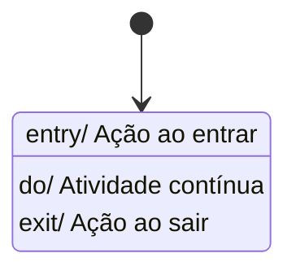
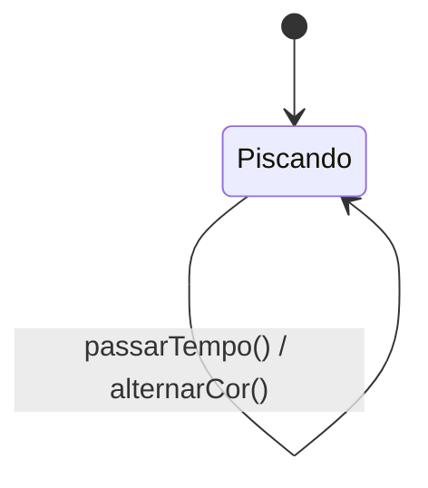
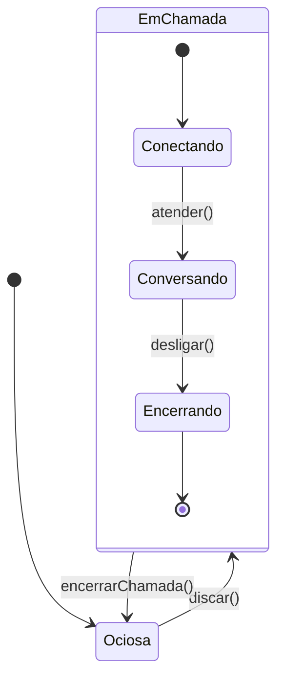
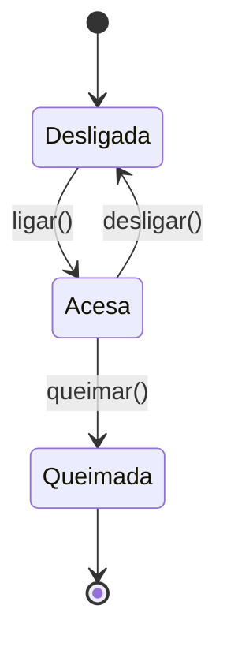
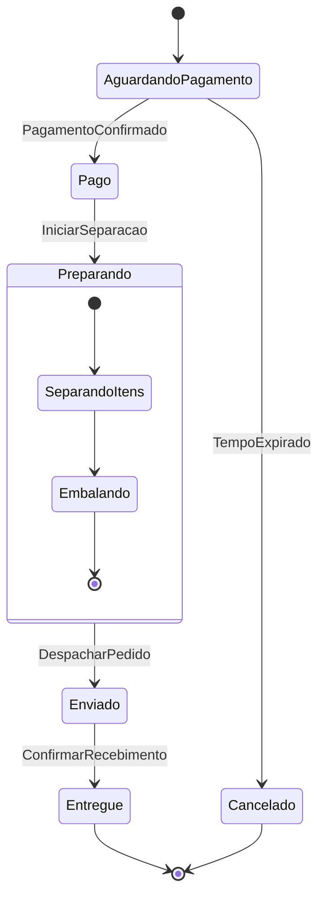
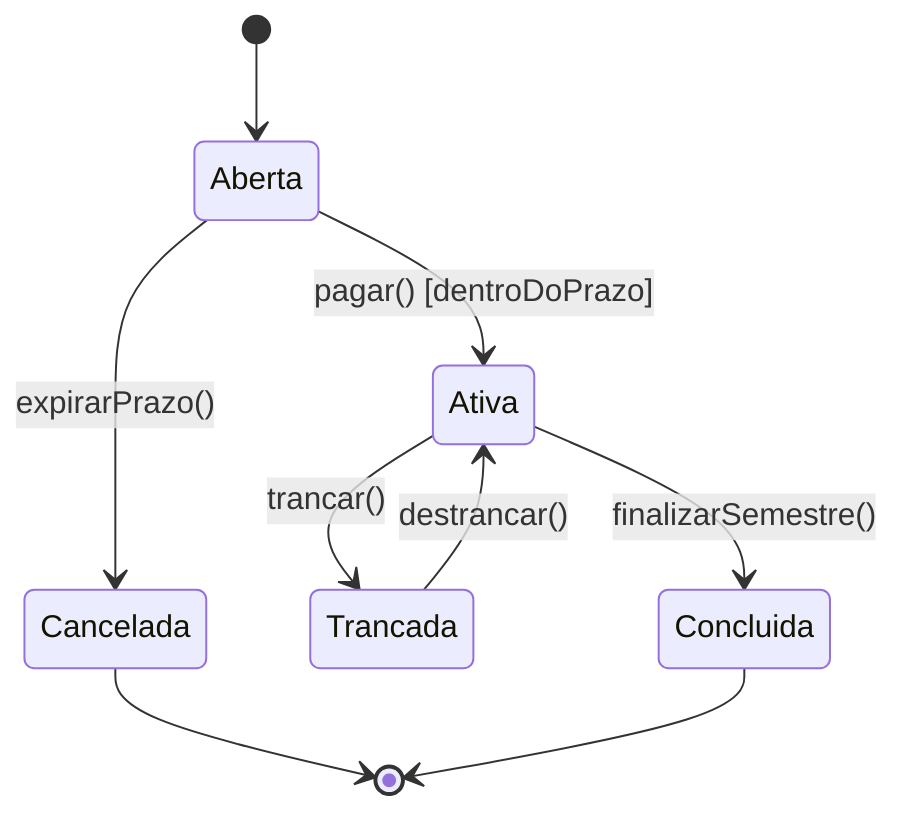

> **Curso:** Engenharia de Software  
> **Disciplina:** Análise e Projeto Orientado a Objetos    
> **Professor:** José Carlos Flores  
> **Tema:**  Diagrama de Máquina de Estados (UML)     
---

## 1. Introdução e Contextualização

Em nossa jornada de modelagem de software, já estudamos diagramas estruturais (como o Diagrama de Classes), que nos respondem *"o que o sistema é?"*. Contudo, o software é uma entidade viva; seus objetos nascem, reagem a estímulos, mudam de condição e, por fim, são destruídos. 
O **Diagrama de Máquina de Estados** (ou Diagrama de Transição de Estados) pertence ao grupo dos diagramas comportamentais da UML. Ele responde à pergunta: *"Como um objeto específico se comporta ao longo de sua vida, em resposta a eventos externos?"*. 
É importante compreender que este diagrama **não modela o sistema inteiro**, mas sim o ciclo de vida de uma **única instância** de uma classe (um objeto) que possui um comportamento complexo e orientado a eventos.

Muitos acadêmicos confundem o DME com fluxogramas. Entretanto, a distinção é fundamental: enquanto o fluxograma descreve um passo a passo algorítmico, a Máquina de Estados descreve as condições (estados) em que um objeto se encontra e como eventos externos ou internos provocam mudanças entre essas condições.

> **Definição:** Uma Máquina de Estados é um formalismo que descreve o comportamento de um sistema ou de um objeto por meio de um conjunto finito de estados, transições entre esses estados e ações.

---

## 2. Componentes e Simbologia

Para compreender o diagrama, precisamos primeiro dominar seu vocabulário visual. A UML define uma simbologia precisa para representar os estados e as transições. Abaixo, detalhamos os elementos fundamentais:

### 2.1. Estado (State)
Um estado representa uma condição ou situação durante a vida de um objeto na qual ele satisfaz alguma condição, realiza alguma atividade ou aguarda a ocorrência de um evento.
*   **Simbologia:** Um retângulo com cantos arredondados (estilo "superelipse").
*   **Cabeçalho:** O nome do estado no topo, separado por uma linha horizontal.
*   **Compartimentos Internos:** Podem conter ações associadas ao estado, divididas em:
    *   `entry/` : Ação executada sempre que o objeto *entra* no estado.
    *   `exit/` : Ação executada sempre que o objeto *sai* do estado.
    *   `do/` : Atividade contínua executada *enquanto* o objeto estiver no estado (pode ser interrompida por um evento).
**Figura 1: Representação de um Estado**


### 2.2. Transição (Transition)
É o relacionamento entre dois estados, indicando que um objeto no primeiro estado passará para o segundo quando um evento ocorrer e condições específicas forem atendidas.Uma transição indica a mudança de um estado para outro. É a resposta do objeto a um evento.
*   **Simbologia:** Uma seta (linha contínua com ponta de flecha) apontando do estado de origem para o estado de destino.
*   **Sintaxe Completa da Transição:** `evento [condição-guarda] / ação`
    *   **Evento:** O estímulo que dispara a transição.
    *   **Condição-guarda (Guard Condition):** Uma expressão booleana entre colchetes `[ ]`. A transição só ocorre se o evento acontecer E a condição for verdadeira.
    *   **Ação (Action):** Uma operação executada durante a transição.
**Figura 2: Representação de uma Transição**
```text
[Estado Origem] -----( evento [guarda] / ação )-----> [Estado Destino]
```

### 2.3. Pseudo-estados
- **Escolha (Choice):** Representada por um losango, permite ramificações baseadas em condições de guarda.
- **Junção (Junction):** Utilizada para fundir várias transições em uma única.
- **História (History):** Representada por um (H), permite que um estado composto "lembre" qual era o seu último subestado ativo antes de uma interrupção.

---

## 3. Conceitos Avançados

### 3.1. Auto-transição (Self-transition)
Ocorre quando um evento dispara uma transição que parte e chega no mesmo estado. O objeto sai do estado e entra nele novamente, executando as ações `exit/` e `entry/`.
**Exemplo:** Um semáforo piscando.

### 3.2. Estados Compostos (Submáquinas)
Um estado pode conter uma máquina de estados interna (estados aninhados). Isso é excelente para modelar complexidade sem poluir o diagrama principal.
**Exemplo:** Uma Central Telefônica. O estado "EmChamada" é composto por sub-estados.

---

## 4. Exemplos Práticos

### 4.1. A Lâmpada
Para dissipar dúvidas, utilizemos um exemplo clássico e intuitivo: uma Lâmpada.
Uma lâmpada possui dois estados principais: **Desligada** e **Acesa**. O evento que provoca a transição é o acionamento do interruptor.
**Figura 4: Máquina de Estados de uma Lâmpada**

---
### 4.2. Ciclo de Vida de um Pedido

Para ilustrar a aplicação prática, consideremos o processamento de um pedido em um sistema de E-commerce.



Neste exemplo, observamos um **Estado Composto** (Preparando), que possui seus próprios subestados internos. Isso demonstra a hierarquia e a organização que o DME proporciona em sistemas complexos.

---

### 4.3. Sistema de Matrícula Acadêmica
Agora, apliquemos o conhecimento em um cenário de Engenharia de Software. Modelaremos o ciclo de vida de um objeto **Matrícula** em um sistema universitário.
1. A matrícula começa como *Aberta*.
2. Se o aluno pagar dentro do prazo, vai para *Ativa*.
3. Se o prazo expirar sem pagamento, vai para *Cancelada*.
4. Estando *Ativa*, o aluno pode trancar a matrícula (vai para *Trancada*).
5. Estando *Ativa*, ao final do semestre, vai para *Concluída*.
6. Tanto *Cancelada* quanto *Concluída* são estados finais.
**Figura 5: Máquina de Estados da Matrícula**

*Atenção aos detalhes:* A transição de "Aberta" para "Ativa" possui uma condição-guarda `[dentroDoPrazo]`. Isso significa que o evento `pagar()` só surtirá efeito se a avaliação da guarda for verdadeira.  
---  

## 5. Referências Bibliográficas

1. **BEZERRA, Eduardo.** *Princípios de Análise e Projeto de Sistemas com UML*. 3. ed. Rio de Janeiro: Elsevier, 2014.
2. **GUEDES, Gilleanes T. A.** *UML 2 - Guia Prático*. 2. ed. São Paulo: Érica, 2011.
3. **LARMAN, Craig.** *Utilizando UML e Padrões: uma introdução à análise e ao projeto orientados a objetos e ao desenvolvimento iterativo*. 3. ed. Porto Alegre: Bookman, 2007.
4. **BOOCH, Grady; RUMBAUGH, James; JACOBSON, Ivar.** *UML: Guia do Usuário*. 2. ed. Rio de Janeiro: Elsevier, 2006.
5. **OMG.** *Unified Modeling Language (UML) Specification*. Version 2.5.1. Object Management Group, 2017. Disponível em: <https://www.omg.org/spec/UML/>.
---
<br>

**Prof. José Carlos Flores**  
Docente de Engenharia de Software e Tecnologia em ADS  
Disciplina de Análise e Projeto Orientado a Objetos  
*"Modelar com rigor é o primeiro passo para implementar com excelência."*

---

## 👤 GitHub

[](https://github.com/floresjcd) 
**[@floresjcd](https://github.com/floresjcd)**