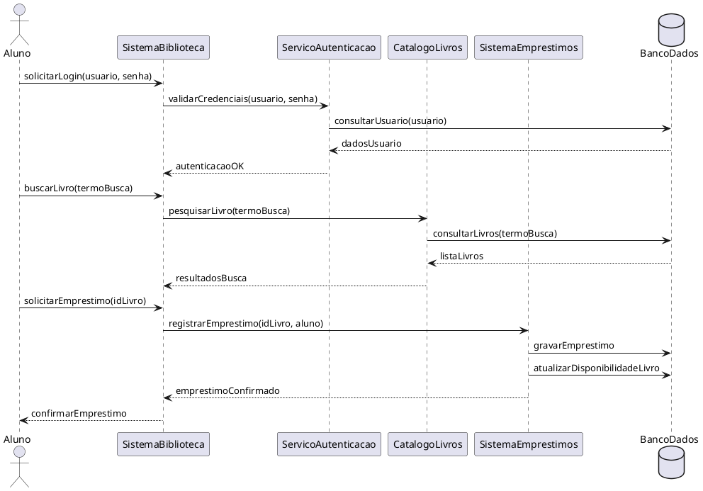
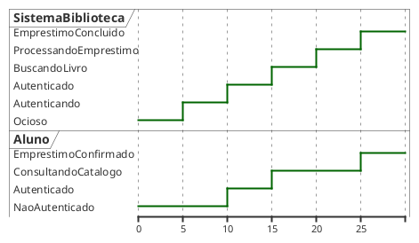

Perfeito. A seguir está a **atividade proposta**, elaborada no papel do **prof. José Carlos Flores**, pronta para uso em sala ou AVA.

***

## Atividade Prática – Diagramas de Interação UML

**Disciplina:** Engenharia de Software / Análise e Projeto de Sistemas  
**Conteúdo:** Diagramas de Interação UML  
**Diagramas abordados:**

* Diagrama de Sequência
* Diagrama de Comunicação
* Diagrama Geral de Interação
* Diagrama de Tempo

### Objetivo da atividade

Desenvolver a capacidade de modelar interações entre objetos em um sistema, compreendendo as diferentes visões oferecidas pelos diagramas de interação da UML e suas aplicações em um mesmo cenário.

***

## Cenário Proposto

Uma **plataforma de biblioteca universitária on-line** permite que alunos realizem o empréstimo de livros digitais e físicos. O sistema possui os seguintes participantes principais:

* **Aluno** (usuário do sistema)
* **Sistema da Biblioteca**
* **Catálogo de Livros**
* **Serviço de Autenticação**
* **Sistema de Empréstimos**
* **Banco de Dados**

### Descrição do fluxo principal

1. O aluno acessa o sistema da biblioteca e realiza o login informando usuário e senha.
2. O sistema valida as credenciais por meio do serviço de autenticação.
3. Após autenticado, o aluno realiza uma busca por um livro no catálogo.
4. O sistema exibe os resultados da busca com a disponibilidade do livro.
5. O aluno solicita o empréstimo de um livro disponível.
6. O sistema registra o empréstimo, atualiza a disponibilidade do livro e confirma a operação ao aluno.

Considere que o sistema possui restrições de tempo para algumas operações, como autenticação e registro do empréstimo.

***

## Atividades a serem desenvolvidas

Com base **exclusivamente no cenário descrito**, os acadêmicos deverão elaborar:

### 1. Diagrama de Sequência

* Representar a ordem temporal das mensagens trocadas entre os participantes durante o fluxo principal.
* Evidenciar chamadas de métodos, retornos e ativação dos objetos.

### 2. Diagrama de Comunicação

* Representar os mesmos participantes e interações do diagrama de sequência.
* Evidenciar o foco na **estrutura das ligações** entre os objetos e na numeração das mensagens.

### 3. Diagrama Geral de Interação

* Modelar o fluxo geral do processo de empréstimo, utilizando nós de decisão, início e fim.
* Indicar onde outros diagramas de interação (como sequência) são referenciados.

### 4. Diagrama de Tempo

* Representar o comportamento temporal de pelo menos **dois participantes** (ex.: Aluno e Sistema da Biblioteca).
* Evidenciar estados, mudanças ao longo do tempo e restrições temporais relevantes.

***

## Orientações Gerais

* Os diagramas devem seguir a **notação UML padrão**.
* Podem ser utilizados softwares de modelagem (StarUML, Visual Paradigm, Draw\.io, Lucidchart, entre outros).
* Cada diagrama deve ser entregue de forma clara, organizada e identificada.
* A atividade pode ser realizada **individualmente ou em dupla**, conforme orientação do professor.

***

## Critérios de Avaliação (sugestão)

* Correta identificação dos participantes
* Coerência com o cenário proposto
* Uso adequado da notação UML
* Clareza e organização dos diagramas
* Consistência entre os diferentes diagramas

***


# ✅ Solução – Diagramas de Interação UML

**Cenário:** Sistema de Biblioteca Universitária On-line

## Participantes (objetos/atores)

* **Aluno**
* **SistemaBiblioteca**
* **ServicoAutenticacao**
* **CatalogoLivros**
* **SistemaEmprestimos**
* **BancoDados**

***

## 1️⃣ Diagrama de Sequência – Empréstimo de Livro

### Objetivo

Representar a **ordem temporal das mensagens** trocadas durante o processo de login, busca e empréstimo.

### Sequência de Interações

1. **Aluno → SistemaBiblioteca:** solicitarLogin(usuario, senha)

2. **SistemaBiblioteca → ServicoAutenticacao:** validarCredenciais(usuario, senha)

3. **ServicoAutenticacao → BancoDados:** consultarUsuario(usuario)

4. **BancoDados → ServicoAutenticacao:** dadosUsuario

5. **ServicoAutenticacao → SistemaBiblioteca:** autenticacaoOK

6. **Aluno → SistemaBiblioteca:** buscarLivro(termoBusca)

7. **SistemaBiblioteca → CatalogoLivros:** pesquisarLivro(termoBusca)

8. **CatalogoLivros → BancoDados:** consultarLivros(termoBusca)

9. **BancoDados → CatalogoLivros:** listaLivros

10. **CatalogoLivros → SistemaBiblioteca:** resultadosBusca

11. **Aluno → SistemaBiblioteca:** solicitarEmprestimo(idLivro)

12. **SistemaBiblioteca → SistemaEmprestimos:** registrarEmprestimo(idLivro, aluno)

13. **SistemaEmprestimos → BancoDados:** gravarEmprestimo

14. **SistemaEmprestimos → BancoDados:** atualizarDisponibilidadeLivro

15. **SistemaEmprestimos → SistemaBiblioteca:** emprestimoConfirmado

16. **SistemaBiblioteca → Aluno:** confirmarEmprestimo

✔ Ênfase: **linha do tempo**, **ativação de objetos** e **retornos**.

***

## 2️⃣ Diagrama de Comunicação – Empréstimo de Livro

### Objetivo

Representar as **ligações estruturais** entre os objetos e a **numeração das mensagens**.

### Objetos

* Aluno
* SistemaBiblioteca
* ServicoAutenticacao
* CatalogoLivros
* SistemaEmprestimos
* BancoDados

### Mensagens (numeradas)

1. Aluno → SistemaBiblioteca: solicitarLogin()  
   1.1 SistemaBiblioteca → ServicoAutenticacao: validarCredenciais()  
   1.1.1 ServicoAutenticacao → BancoDados: consultarUsuario()

2. Aluno → SistemaBiblioteca: buscarLivro()  
   2.1 SistemaBiblioteca → CatalogoLivros: pesquisarLivro()  
   2.1.1 CatalogoLivros → BancoDados: consultarLivros()

3. Aluno → SistemaBiblioteca: solicitarEmprestimo()  
   3.1 SistemaBiblioteca → SistemaEmprestimos: registrarEmprestimo()  
   3.1.1 SistemaEmprestimos → BancoDados: gravarEmprestimo()  
   3.1.2 SistemaEmprestimos → BancoDados: atualizarDisponibilidadeLivro()

✔ Ênfase: **quem se comunica com quem** e **ordem lógica**, não temporal.

***

## 3️⃣ Diagrama Geral de Interação

### Objetivo

Apresentar uma **visão macro do fluxo**, orquestrando outros diagramas de interação.

### Fluxo

* **Nó Inicial**
* Referência: *Diagrama de Sequência – Login*
* Decisão: **Usuário autenticado?**
  * ❌ Não → Encerrar fluxo
  * ✅ Sim →
    * Referência: *Diagrama de Sequência – Busca de Livro*
    * Decisão: **Livro disponível?**
      * ❌ Não → Encerrar fluxo
      * ✅ Sim →
        * Referência: *Diagrama de Sequência – Empréstimo*
* **Nó Final**

✔ Utiliza **interactionUse**, decisões e controle de fluxo.

***

## 4️⃣ Diagrama de Tempo

### Objetivo

Representar **estados dos objetos ao longo do tempo** e **restrições temporais**.

### Linha do Tempo – Objeto: SistemaBiblioteca

| Tempo | Estado                 |
| ----- | ---------------------- |
| t0    | Ocioso                 |
| t1    | Autenticando           |
| t2    | Autenticado            |
| t3    | Buscando Livro         |
| t4    | Processando Empréstimo |
| t5    | Empréstimo Concluído   |

⏱ Restrição:

* Autenticação ≤ **5 segundos**
* Registro do empréstimo ≤ **3 segundos**

### Linha do Tempo – Objeto: Aluno

| Tempo | Estado                |
| ----- | --------------------- |
| t0    | Não autenticado       |
| t2    | Autenticado           |
| t3    | Consultando catálogo  |
| t5    | Empréstimo confirmado |

✔ Ênfase: **mudança de estado x tempo**.

***


# 📌 1. Diagrama de Sequência – Empréstimo de Livro



***

# 📌 2. Diagrama de Comunicação

> Em PlantUML, o diagrama de comunicação é representado como um **diagrama de objetos com mensagens numeradas**.



***

# 📌 3. Diagrama Geral de Interação

> Representado em PlantUML como um **diagrama de atividades com `interactionUse`**.

```plantuml
@startuml
start

:Login do Aluno;
ref over SistemaBiblioteca : Diagrama de Sequência - Login

if (Usuário autenticado?) then (Sim)
  :Busca de Livro;
  ref over SistemaBiblioteca : Diagrama de Sequência - Busca

  if (Livro disponível?) then (Sim)
    :Empréstimo de Livro;
    ref over SistemaBiblioteca : Diagrama de Sequência - Empréstimo
  else (Não)
    stop
  endif

else (Não)
  stop
endif

stop
@enduml
```

***

# 📌 4. Diagrama de Tempo



***


# 📘 1. Diagrama de Sequência – **Versão Comentada**


📌 **Exploração em sala**:

* “Quem inicia a interação?”
* “Qual objeto concentra as decisões?”
* “Onde ocorre a persistência de dados?”

***

# 📘 2. Diagrama de Comunicação – **Versão Comentada**

```plantuml
@startuml
' Objetos envolvidos na comunicação
object Aluno
object SistemaBiblioteca
object ServicoAutenticacao
object CatalogoLivros
object SistemaEmprestimos
object BancoDados

' As mensagens são numeradas para indicar a ordem lógica
Aluno -> SistemaBiblioteca : 1: solicitarLogin()
SistemaBiblioteca -> ServicoAutenticacao : 1.1: validarCredenciais()
ServicoAutenticacao -> BancoDados : 1.1.1: consultarUsuario()

Aluno -> SistemaBiblioteca : 2: buscarLivro()
SistemaBiblioteca -> CatalogoLivros : 2.1: pesquisarLivro()
CatalogoLivros -> BancoDados : 2.1.1: consultarLivros()

Aluno -> SistemaBiblioteca : 3: solicitarEmprestimo()
SistemaBiblioteca -> SistemaEmprestimos : 3.1: registrarEmprestimo()
SistemaEmprestimos -> BancoDados : 3.1.1: gravarEmprestimo()
SistemaEmprestimos -> BancoDados : 3.1.2: atualizarDisponibilidadeLivro()

@enduml
```


📌 **Exploração em sala**:

* “Por que este diagrama **não mostra o tempo**, apenas a estrutura?”
* “Como a numeração substitui o eixo temporal?”

***

# 📘 3. Diagrama Geral de Interação – **Versão Comentada**

```plantuml
@startuml
' Início do fluxo geral
start

' Etapa de autenticação
:Login do Aluno;
' ref indica reutilização de um diagrama de interação
ref over SistemaBiblioteca : Diagrama de Sequência - Login

' Nó de decisão
if (Usuário autenticado?) then (Sim)

  :Busca de Livro;
  ref over SistemaBiblioteca : Diagrama de Sequência - Busca

  if (Livro disponível?) then (Sim)

    :Empréstimo de Livro;
    ref over SistemaBiblioteca : Diagrama de Sequência - Empréstimo

  else (Não)
    ' Fluxo alternativo encerrado
    stop
  endif

else (Não)
  stop
endif

' Fim do fluxo
stop
@enduml
```

📌 **Exploração em sala**:

* “Qual a diferença entre este diagrama e um diagrama de atividades comum?”
* “Por que ele **orquestra** outros diagramas?”

***

# 📘 4. Diagrama de Tempo – **Versão Comentada**


📌 **Exploração em sala**:

* “O que muda aqui em relação ao diagrama de sequência?”
* “Por que o tempo explícito é importante em sistemas críticos?”

***
